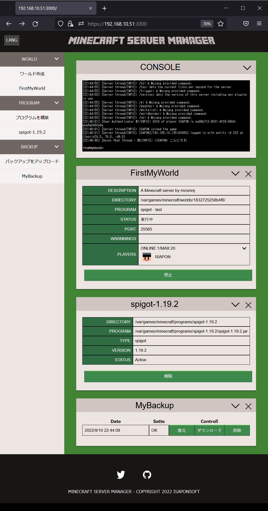

# mcsmweb

Minecraft server manager WEB UI

## Overview

Software for managing the world server of Minecraft on the web. Works on FreeBSD and Linux.

The functions are implemented to a minimum and the interface is made as easy to understand as possible.

## How to install

[INSTALL.md](INSTALL.md)

## Translation status

|Lang|Code|Status|Documents|
|--|--|--|--|
|Deutsch|de|machine translation|
|English(US)|en-US|machine translation|[Tutorial](docs/en_us-tutorial.md)|
|Français|fr|machine translation|
|जापानी|hi|machine translation|
|日本語|ja|Yes (standard)|[チュートリアル](docs/ja-tutorial.md)|
|简体中文|zh-CN|machine translation|
|繁體中文|zh-TW|machine translation|

## Require

* FreeBSD, Linux
* node.js, git, java

## Function

|Function|Status|
|--|--|
|World create|OK|
|World create from backup|OK|
|World delete|OK|
|World configuration|OK|
|World backup|OK|
|World backup(dynamic)|not available|
|Multi world management|OK|
|Realtime server console|OK|
|Vanilla server download|OK|
|spigot server auto build|OK|
|Plugin manager|not available|

## Sample

