# mcsmweb

Minecraft server manager WEB UI

How to install: [INSTALL.md](../INSTALL.md)

## Overview

Software for managing the world server of Minecraft on the web. Works on FreeBSD and Linux.

The functions are implemented to a minimum and the interface is made as easy to understand as possible.

## Usage

## 1. login

　Access mcsmweb with a browser, where the URL is the IP address of the server and the port number you specified during installation (default is 3000). For example, if the server IP address is 192.168.10.51 and the port number is set to 3000, the URL will be https://192.168.10.51:3000/.

　After accessing the site, a login screen will appear as shown in the figure below, and enter the administrator's user name and password. If you did not change them during installation, the user name is "admin" and the password is "pass".


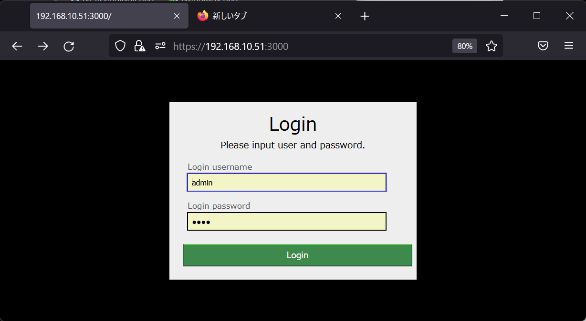

## 2. main screen

　When you log in, you will initially see only "CONSOLE" as shown in the figure below. The first thing to do is to create a world or build a program.

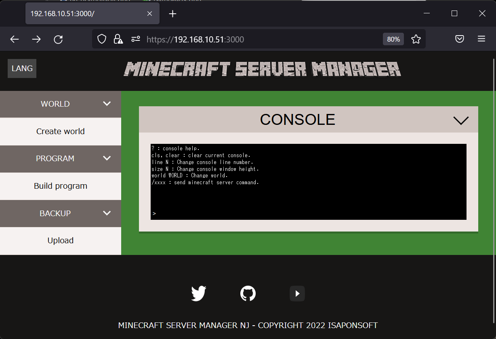


## 3. world creation

　First, let's create a world for players to log into. mcsmweb allows you to build and manage multiple world servers on a single server computer.

　However, running multiple worlds at the same time requires a lot of server computer specs (CPU and memory). If you are short on specs, it is a good idea to start a world only when you are playing, and stop the worlds that you are not playing.

　Now, select "Create World" from the menu on the left.

　A dialog box similar to the one below will appear, so enter a name in the "World Name" field that is easy for you to understand. The world name is the name that will be displayed on mcsmweb, so you can use non-alphanumeric characters. Leave the other fields as they are for now.

　After deciding on a world name, click "Create".

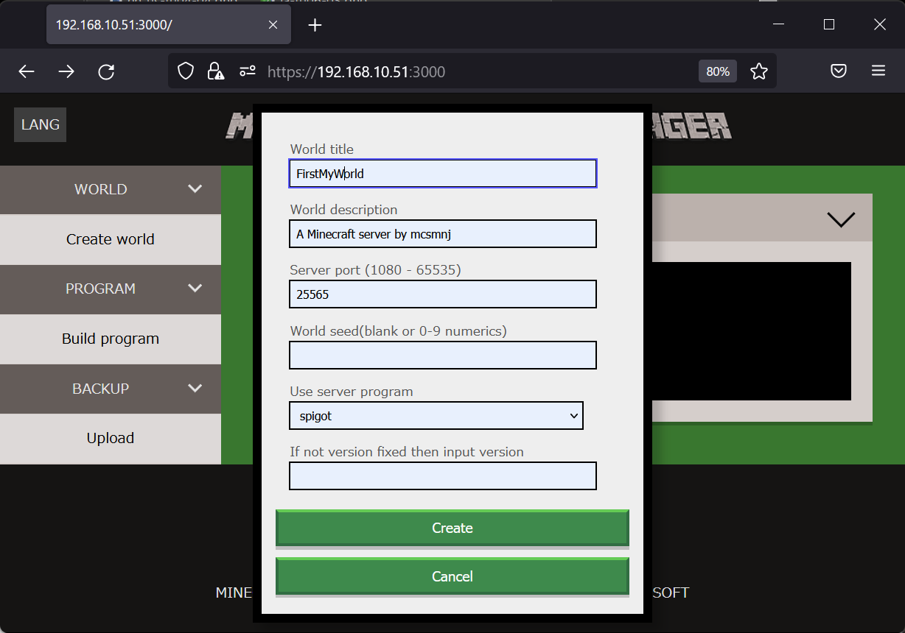

　After creation is complete, the world you just created will appear in the menu on the left. Click on the world. The status of the world will be displayed as shown below.

　However, at this stage, the world cannot be started because there is no server program to run the world, so let's move on to the next step to build a program.

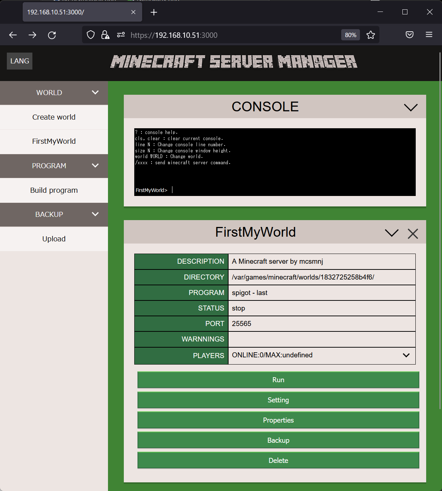

## 4. building the program

　Now we will build the program to run the world. Here we will use the program "spigot" as an example, assuming that we will use mods in the future.

　First, select "Build Program" from the left menu to display the dialog box as shown below. In the case of spigot, you need to specify the version of spigot to be built.

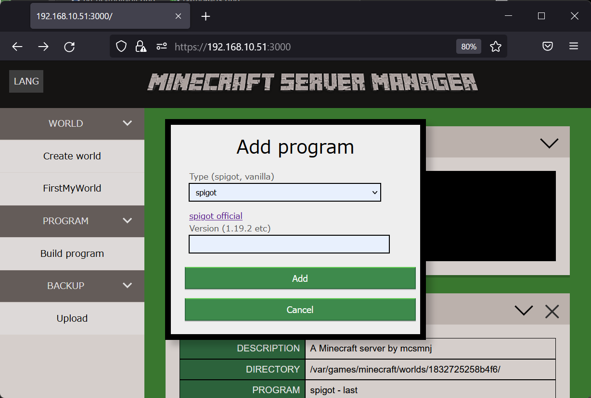

This will open the official spigot website, where you can find the string indicating the latest version and note it down. In this case, 1.19.1 and 1.19.2 seem to be valid, but we will try to use the latest 1.19.2 as much as possible.

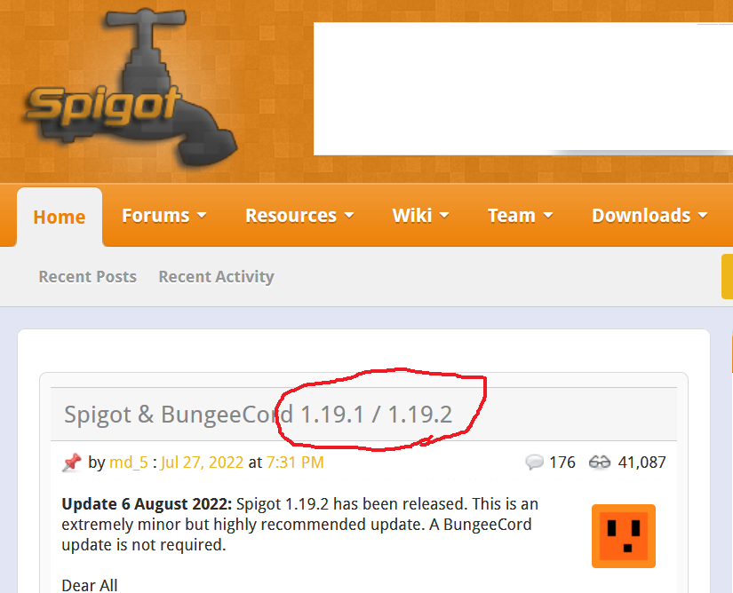

Enter 1.19.2 in the "Version" field of the dialog box and click "Update".


In the case of spigot, you need to download the program on the server and do the "build" process on the server. This is all done automatically by mcsmweb, but it takes a few minutes, so please have a cup of tea and wait for a while.

　When the build is successfully completed, the "STATUS" column will change to "Active". If you get a "Build error", please wait a little longer and then "delete" the program and build it again.

If you get a "Build error", please wait a little and then delete the program and build it again. 

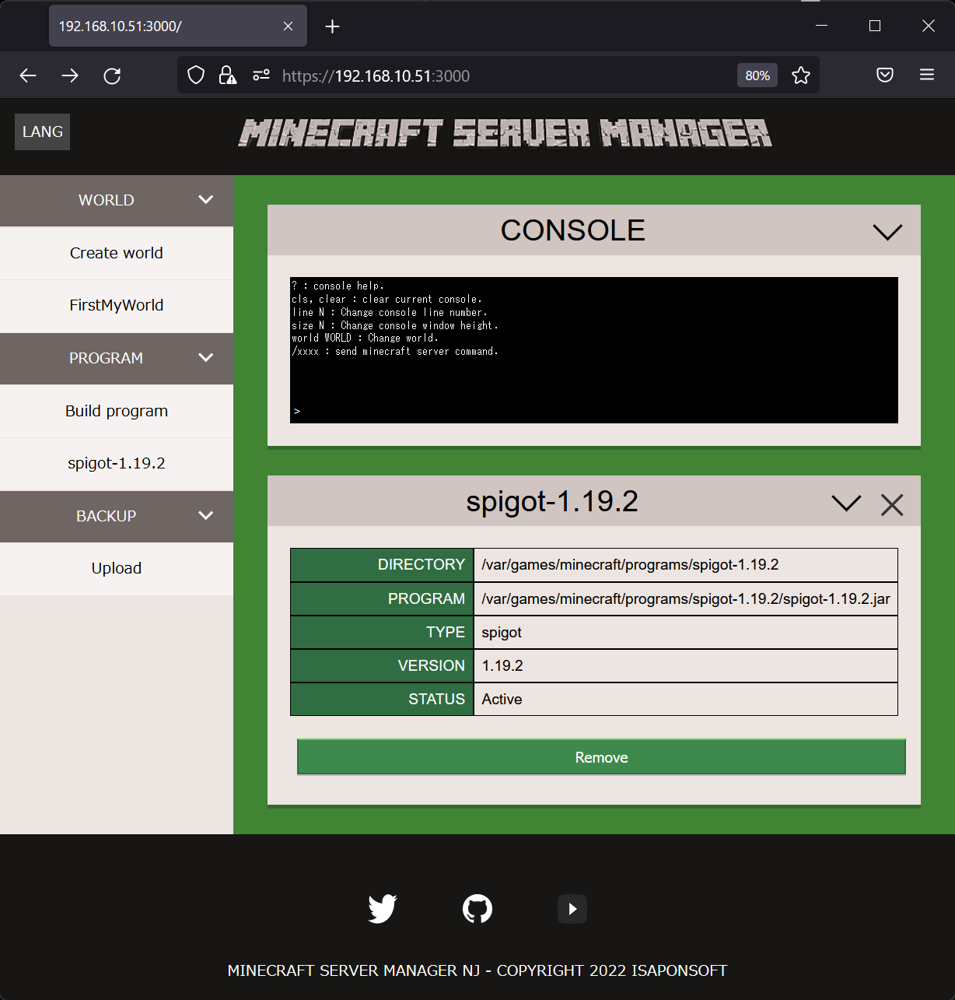

## 5. Start the world

　Select a world from the menu on the left and press the "Start" button. You will then see the server program log in the "CONSOLE" at the top of the screen and probably a button that says "Check EULA".

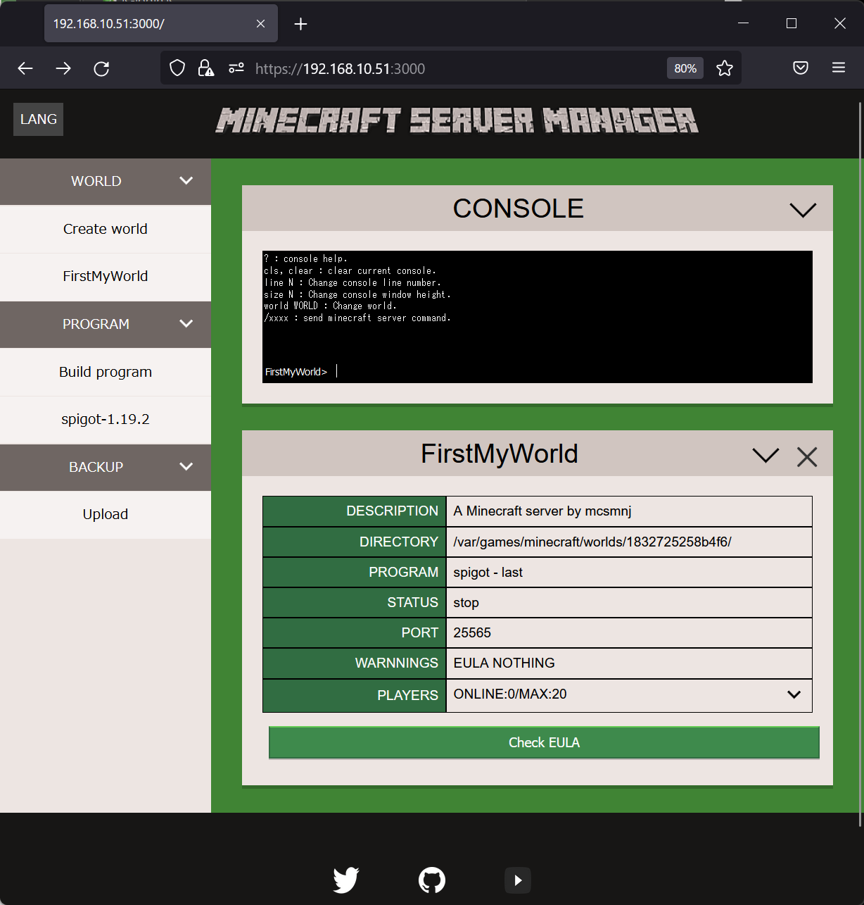

　Click this button when the "Confirm EULA" appears. This will bring up the "MINECRAFT End User License Terms" page. After carefully reading the contents of this page, please proceed to the next step.


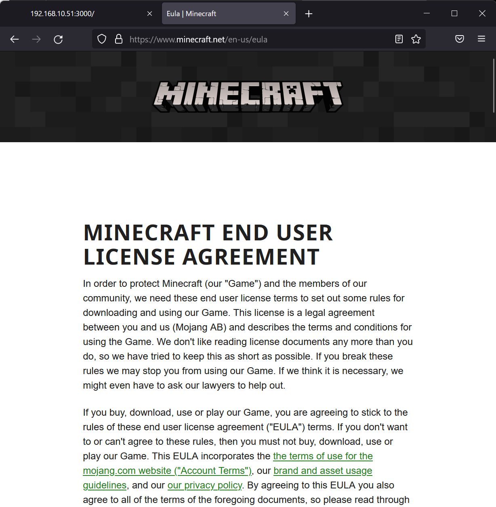

Please read the contents of the "MINECRAFT End User License Agreement" carefully, and if you agree with the contents, click the "I accept the EULA" button. If you do not agree with the contents, you may not run the Minecraft server program.

Only if you agree, click the button to proceed to the next step.


　If you press "I agree," you can press the "Start" button again, so press the "Start" button.


　The program starts and the log is displayed in "CONSOLE". The first time the world is launched, it will take some time to generate the world. When the world creation is finished, "STATUS" will change to "Running". This completes the world startup.

　Note that if you stop the program and start it again, the EULA agreement will be skipped. Also, the waiting time will be shortened because the generation time of the world is also skipped.

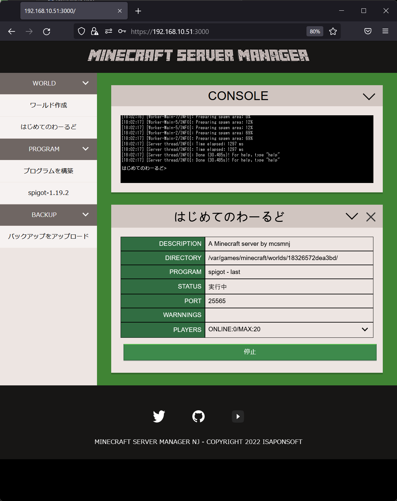

## 6. try to log in

　Now let's actually play in the world. Start the Minecraft client program, select "Multiplayer" and choose "Add Server".


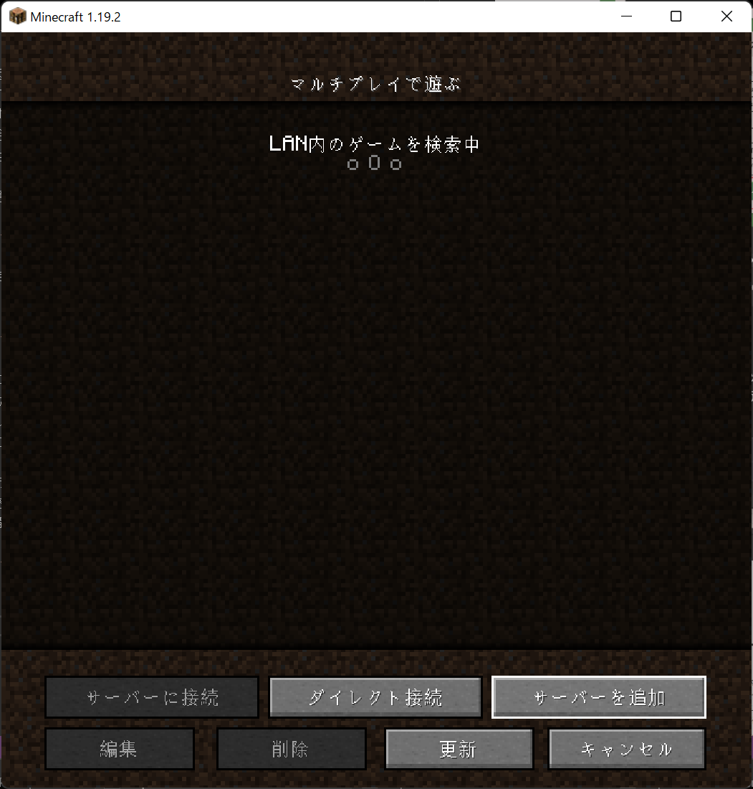

　In the "Server Name" field, enter a name that is easy for you to understand; it does not have to match the name in mcsmweb. The important part is the "Server address". Enter the IP address of mcsmweb and the world "PORT" here.

　For example, if mcsmweb's IP address is ``192.168.10.51`` and the world's PORT is ``25565``, you need to connect them with ``:`` and enter ``192.168.10.51:25565``.

　Note that if PORT is 25565, you can omit ``:25565`` and just enter the IP address. When you are done, press "Done".

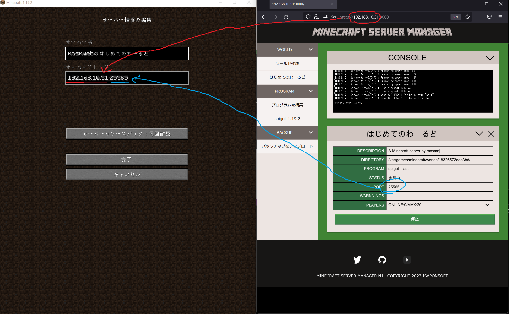

　If Minecraft correctly recognizes the server, you will see the server's "DESCRIPTION" displayed as shown below.

　In this state, you can enter the world by pressing "Connect to server".

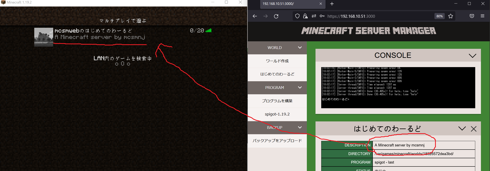

　Once you enter the world, the names of logged-in players are displayed on mcsmweb. You can also see the skins of the players.

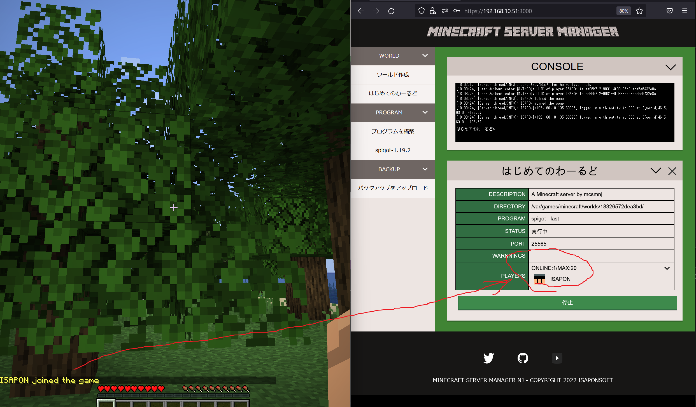

　Type ```/say Hello!!``` in the "CONSOLE" field of mcsmweb and press ENTER. The ```/say``` must be one-byte characters. Also, there must be a space after ```/say```.

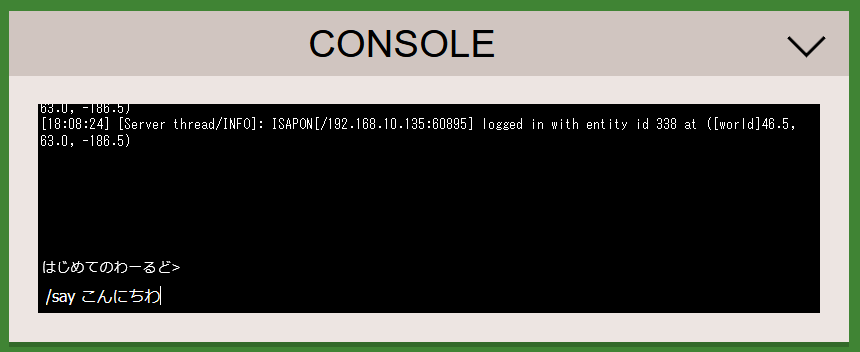

"Hello!!" is now displayed to players who are logged in to the world.

You can execute the server command by typing the minecraft server command with "CONSOLE" like this.

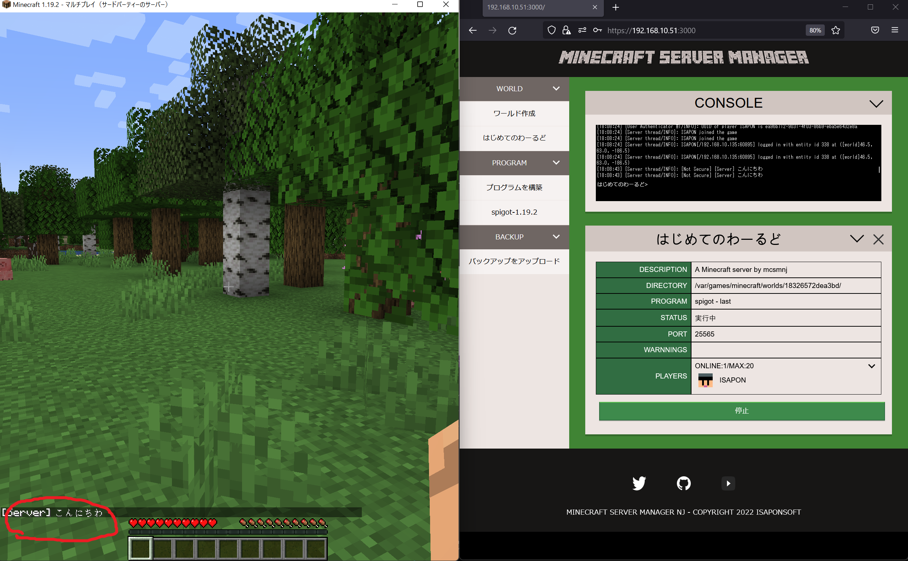
