# mcsmweb

Minecraft server manager WEB UI

インストール方法: [INSTALL.md](../INSTALL.md)

## 概要

　Minecraft のワールドサーバーをWEBで管理するためのソフトウェアです。FreeBSDやLinuxで動作します。

機能は最小限に実装しなるべく理解のしやすいインターフェースにしています。

## 使用法

## 1. ログイン

　ブラウザでmcsmwebにアクセスしてください。URLはサーバーのIPアドレスとインストール時に指定したポート番号（デフォルトでは3000になります）を指定します。例えば、サーバーのIPアドレスが 192.168.10.51 でポート番号を 3000 に設定した場合は https://192.168.10.51:3000/ となります。

　アクセスすると下図のようなログイン画面が出てくるので管理者のユーザー名とパスワードを入力します。インストール時に変更していなければユーザー名は "admin" でパスワードは "pass" になります。

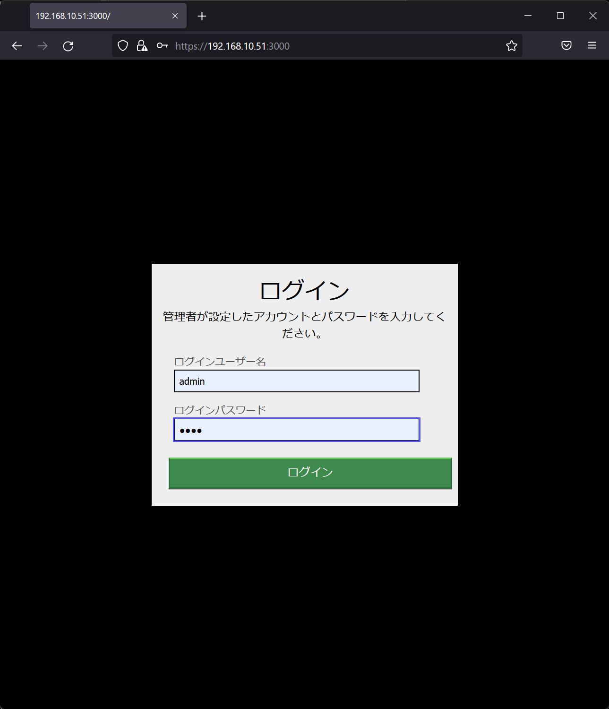

## 2. メイン画面

　ログインすると最初は下図のように "CONSOLE" だけが表示された画面になります。最初に行うのはワールド作成かプログラム構築になります。

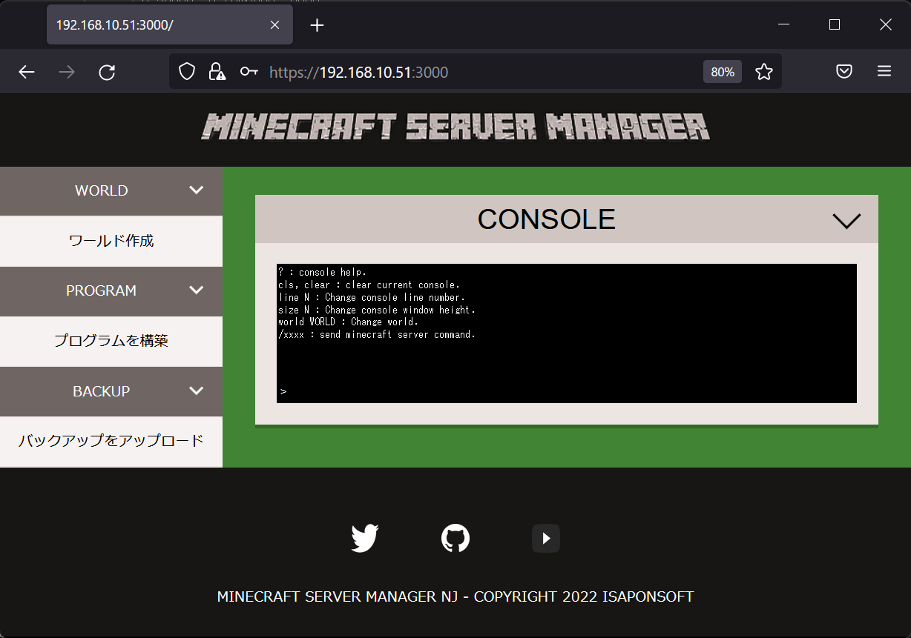


## 3. ワールド作成

　まず初めにプレイヤーがログインするワールドを作成してみましょう。mcsmwebでは１台のサーバーコンピュータに複数のワールドサーバーを構築して管理することが出来ます。

　ただし、複数のワールドを同時に動かすとそれに応じてサーバーコンピュータのスペック（ＣＰＵやメモリ）が沢山必要になってきます。スペックが不足している場合は遊ぶときだけワールドを起動し、遊んでいないワールドは停止すると良いでしょう。

　それでは早速、左のメニューの「ワールド作成」を選んでください。

　下図のようなダイアログが表示されるので、「ワールドの名前」に自分で分かりやすい名前を入力してください。ワールドの名前はmcsmwebで表示する名前なので英数字以外の文字も使用できます。それ以外の項目は今はそのままにしておきましょう。

　ワールドの名前を決めたら「作成」をクリックます。

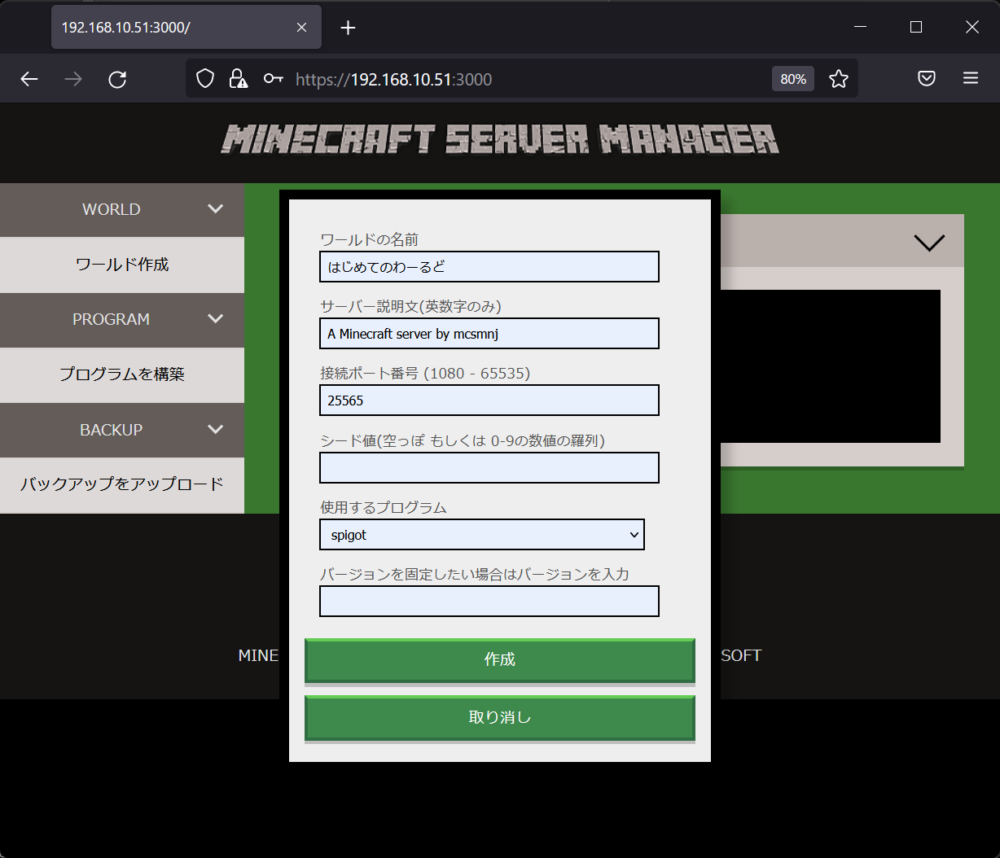

　作成が終わると左のメニューに今作成したワールドが表示されるので、ワールドをクリックしてみてください。下図のようにワールドの状態が表示されます。

　ただし今の段階ではワールドを動かすためのサーバープログラムが無いので起動することができませんので、次のステップに進んでプログラムを構築しましょう。

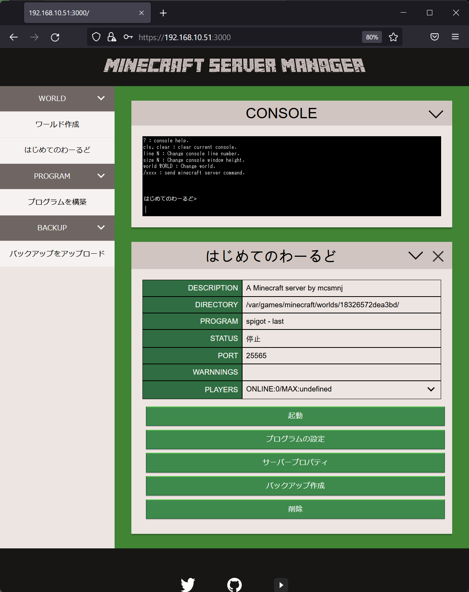

## 4. プログラムの構築

　今度はワールドを動かすためのプログラムを構築します。ここでは将来MODを使用することを想定して「spigot」というプログラムを例に説明します。

　まずは左メニューの「プログラムの構築」を選ぶと下図のようなダイアログが表示されます。spigotの場合は構築するバージョンを指定する必要があります。現在有効なのバージョンを調べるには「spigot official」をクリックしてください。

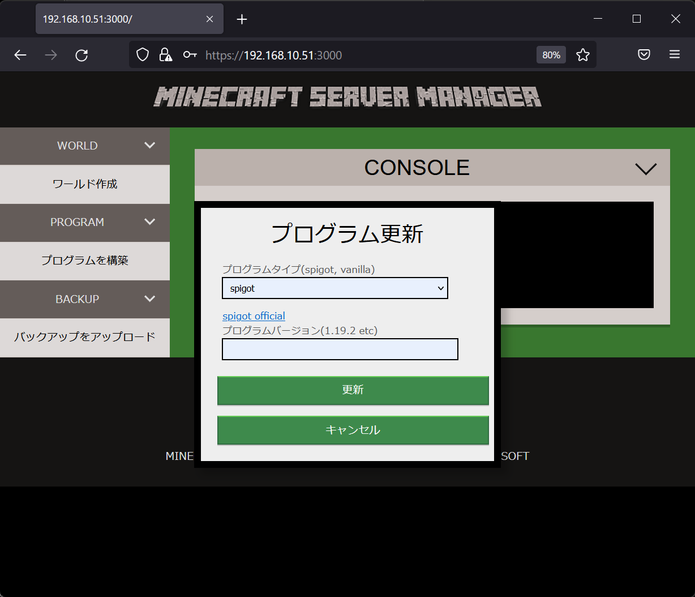

 spigotの公式サイトが開かれるので、ここから最新のバージョンを示す文字列を見つけてメモします。今回は 1.19.1と1.19.2が有効のようですがなるべく最新の 1.19.2 にしてみます。

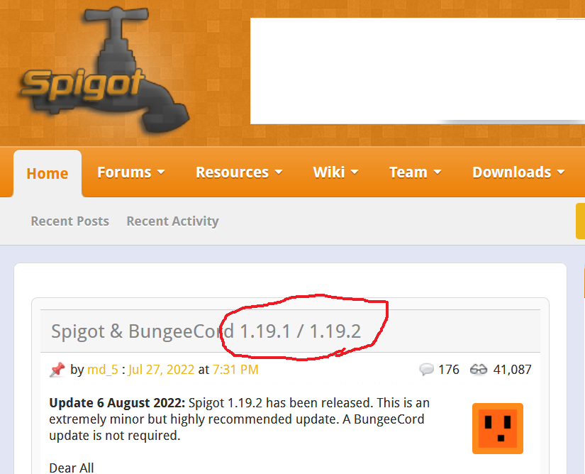

　ダイアログのバージョンの欄に 1.19.2 を入力し「更新」をクリックします。

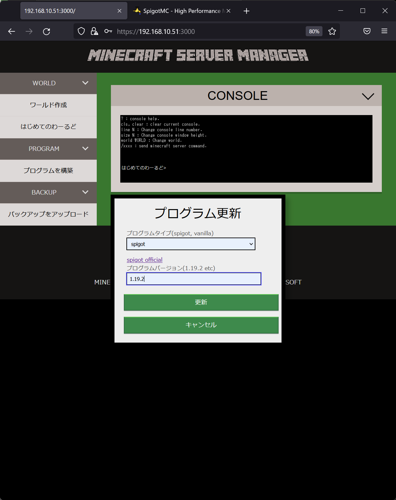

　左のメニューに「spigot-1.19.2」が加わっているのでクリックするとspigot-1.19.2の情報を見ることができます。

　spigotの場合はサーバー上でプログラムをダウンロードして「ビルド」という作業をサーバー上で行う必要があります。これは全てmcsmwebが自動で実行しますが数分かかるのでしばらくお茶でも飲んで待っていてください。

　構築が無事に終わると「STATUS」の欄が「Active」になります。もし「Build error」が出ている場合はすこし時間をおいてから一度「削除」を行い再度プログラムの構築をしてください。

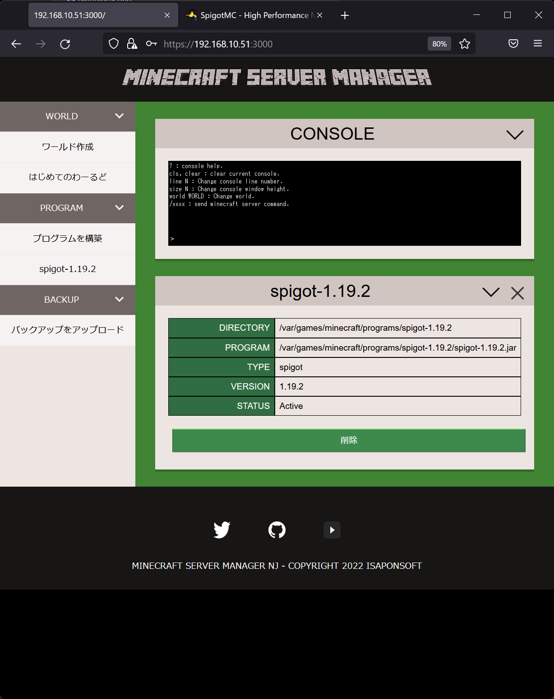

## 5. ワールドを起動する

　左のメニューからワールドを選び「起動」のボタンを押してください。すると画面上部の "CONSOLE" にサーバープログラムのログが表示され、おそらく「EULAを確認する」というボタンが表示されるはずです。


　「EULAを確認する」が表示されたらこのボタンをクリックしてください。そうすることで「MINECRAFT エンド ユーザー ライセンス条項」というページが表示されます。このページの内容をよく読んだら次のステップへ進んでください。

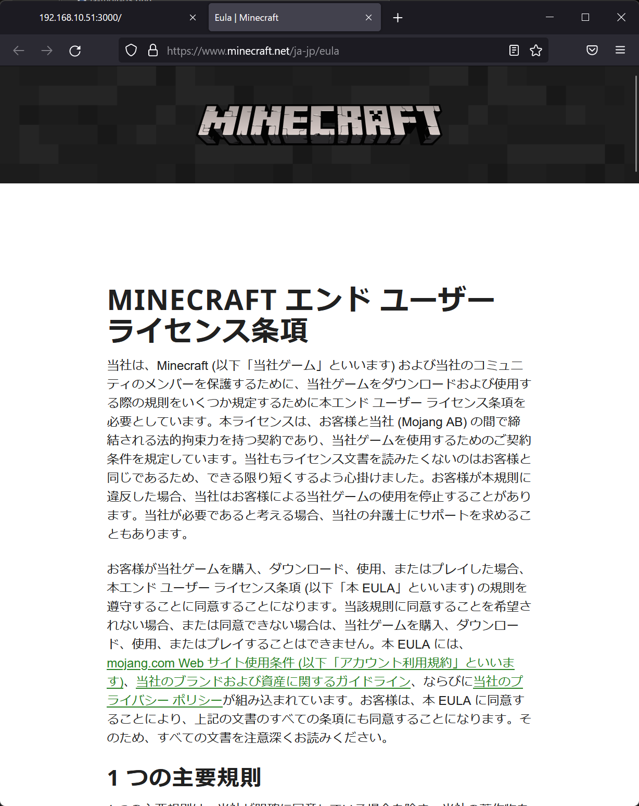

　先ほどの「MINECRAFT エンド ユーザー ライセンス条項」に書かれている内容をしっかり読み、内容に同意したら「EULAに同意する」ボタンを押してください。なお、内容に同意できない場合はマインクラフトのサーバープログラムを動かしてはいけません。

　同意した場合のみボタンを押して次のステップに進みます。

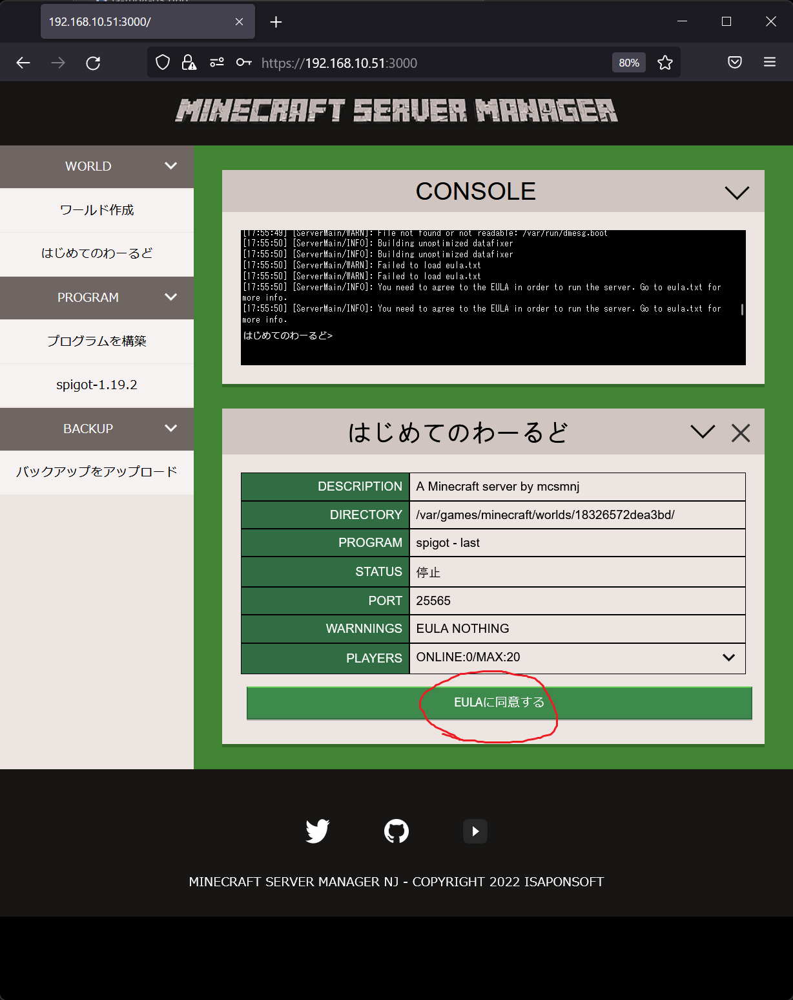

　「同意する」を押すと再び「起動」ボタンが押せるようになっているので「起動」ボタンを押します。


　プログラムが起動し、"CONSOLE"にログが表示されます。初めて起動するワールドはワールドの生成を行うために少し時間がかかります。ワールドの生成が終わると「STATUS」が「実行中」になります。これでワールドの起動が完了しました。

　なお一度停止してからまた起動した場合はEULAの同意はスキップされます。またわーるの生成時間もスキップされるため待ち時間は短くなります。

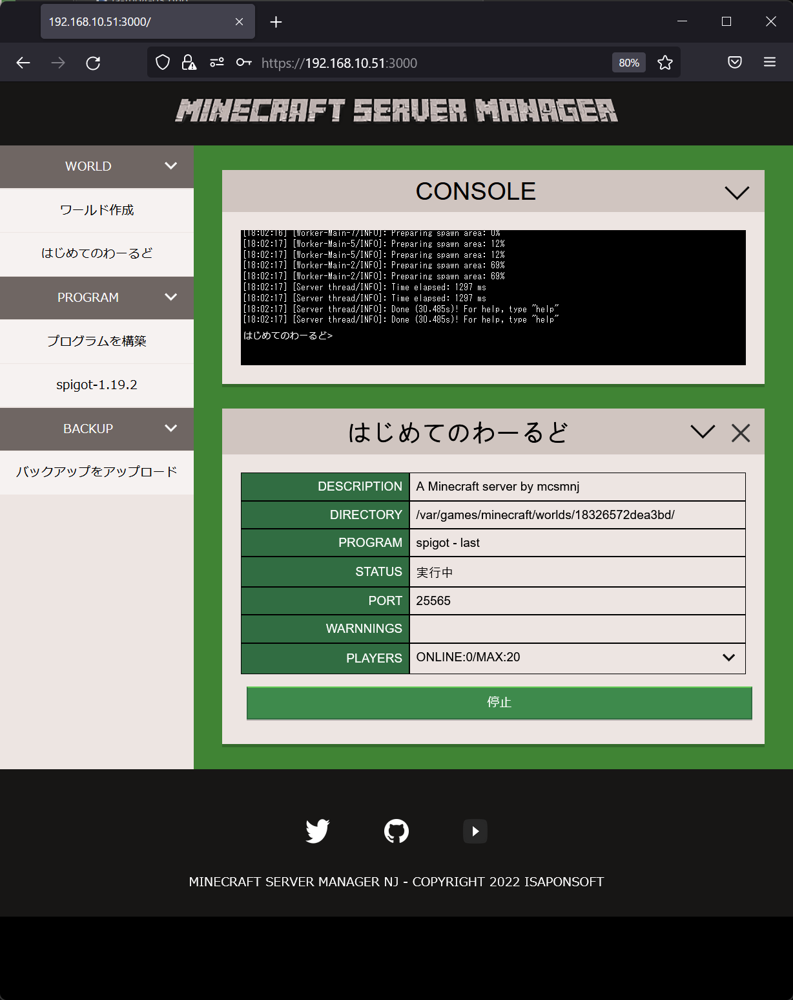

## 6. ログインしてみる

　それでは実際にワールドで遊んでみましょう。マインクラフトのクライアントプログラムを起動し、「マルチプレイ」を選び「サーバーを追加」を選びます。

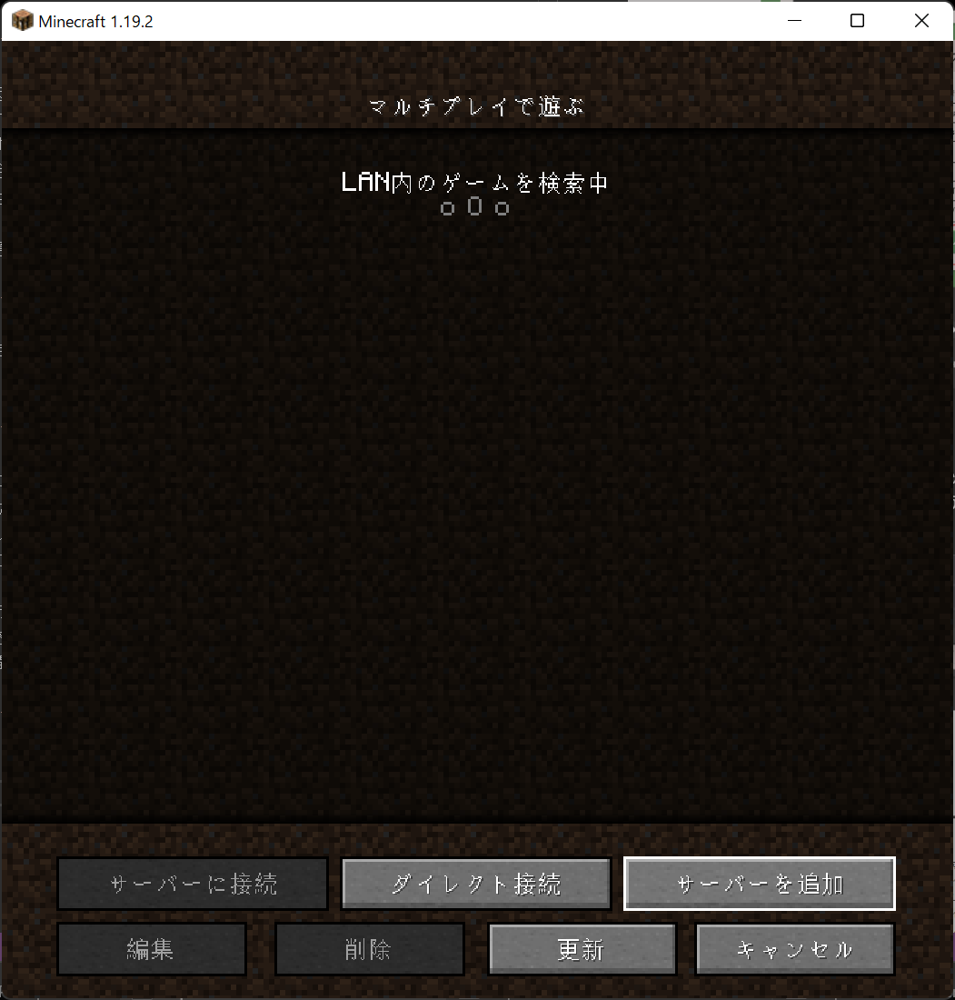

　「サーバー名」には自分で分かりやすい名前を入力してください。mcsmwebでの名前と合わせる必要はありません。大切なのは「サーバーアドレス」です。ここにはmcsmwebのIPアドレスと、ワールドの「PORT」を入力します。

　例えば、mcsmwebのIPアドレスが ```192.168.10.51``` でワールドのPORTが ```25565``` の場合はこれを　```:``` で繋げる必要があり ```192.168.10.51:25565``` と入力します。

　ちなみに PORTが 25565 の場合は ```:25565``` を省略してIPアドレスだけを入力しても大丈夫です。入力が終わったら「完了」を押します。

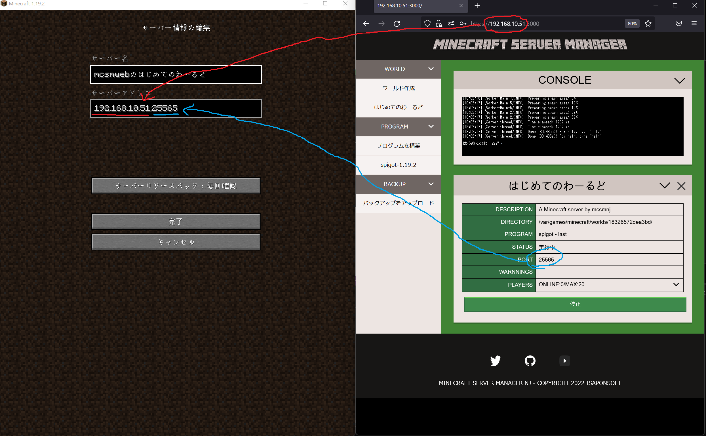

　マインクラフトが正しくサーバーを認識できていれば、下図のようにサーバーの「DESCRIPTION」が表示されているのがわかります。

　この状態で「サーバーに接続」を押すとワールドに入ることができます。

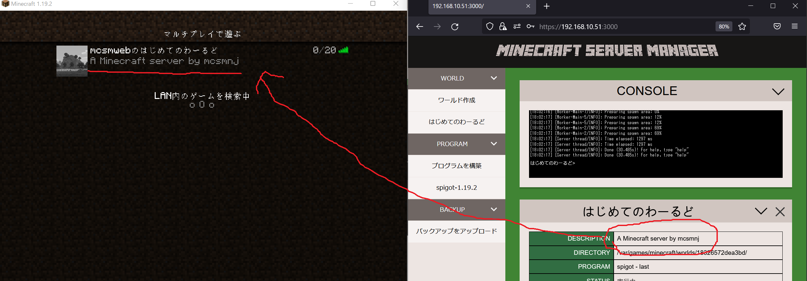

　ワールドに入ると mcsmweb 上にログインしたプレイヤーの名前が表示されます。mcsmweb を見ることでログイン中のプレイヤーが確認できます。またプレイヤーのスキンも表示れます。

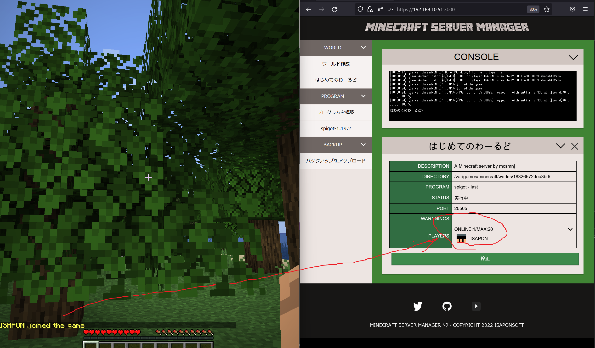

　mcsmwebの"CONSOLE"に ```/say こんにちわ``` と入力し、ENTERキーを押してみましょう。```/say``` は半角文字にしてください。また、```/say``` の後ろには半角スペースが必要です。

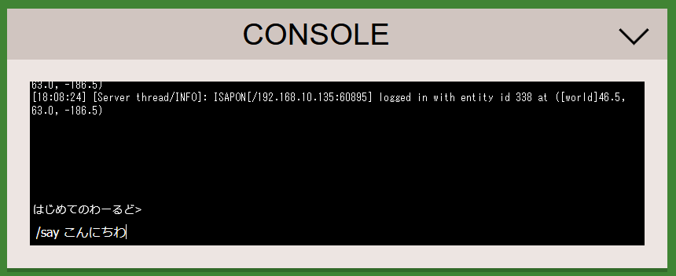

　ワールドにログインしているプレイヤーに「こんにちわ」が表示されました。

　このように "CONSOLE" でマインクラフトサーバーのコマンドを入力することでサーバーのコマンドを実行することができます。

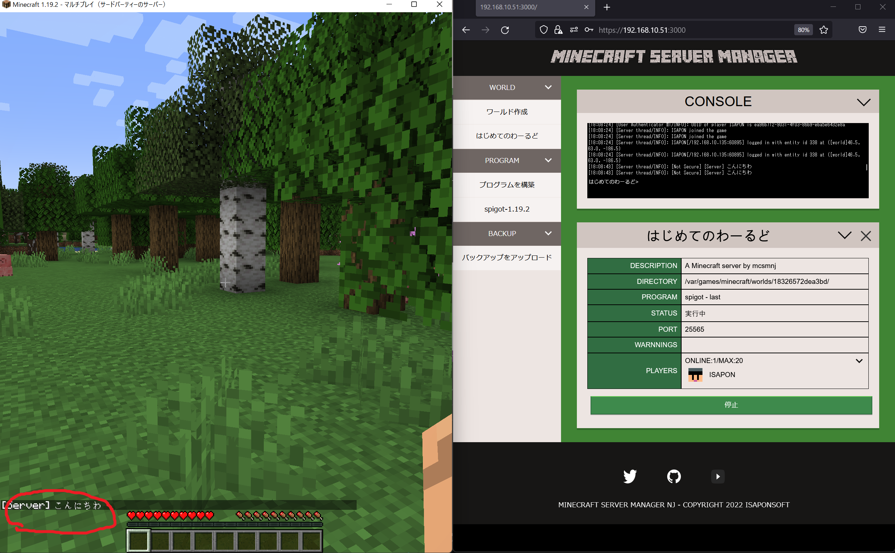
